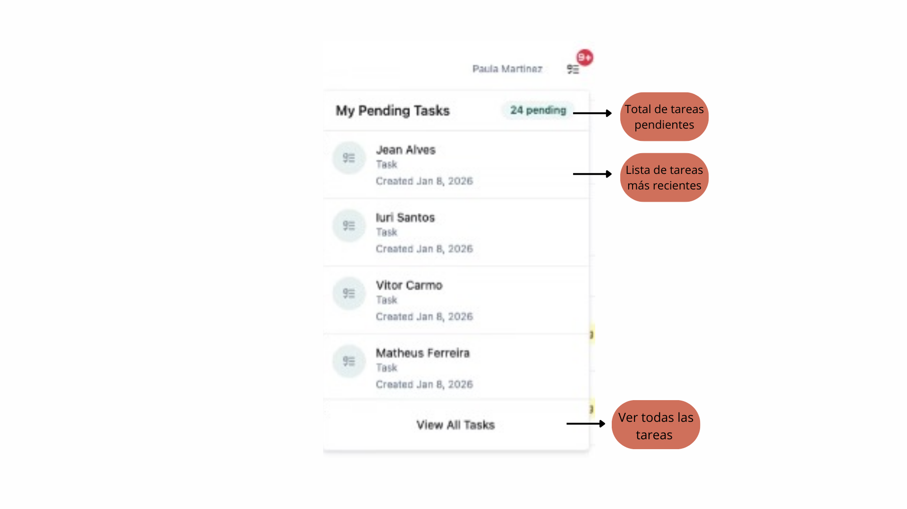
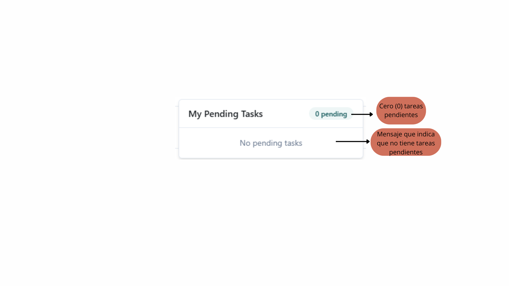

## Objetivo
Visualizar y rápidamente tareas pendientes por realizar, para mantener el flujo operativo al día.

## Funcionamiento

- **Con pendientes:** Se muestra una lista detallada de tareas por realizar (ver imagen 1).

imagen 1: Vista con tareas pendientes

- **Sin pendientes:** Aparece el mensaje “No pending tasks” confirmando que estás al día con tus tareas (ver imagen 2).

imagen 2: Vista sin tareas pendientes

Este módulo es accesible directamente desde la pantalla principal del Dashboard.

## Recomendaciones
- Revisa esta sección al iniciar y finalizar tu jornada.
- Prioriza las tareas urgentes.      
