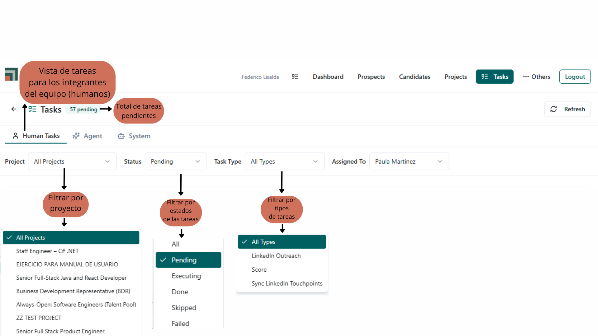
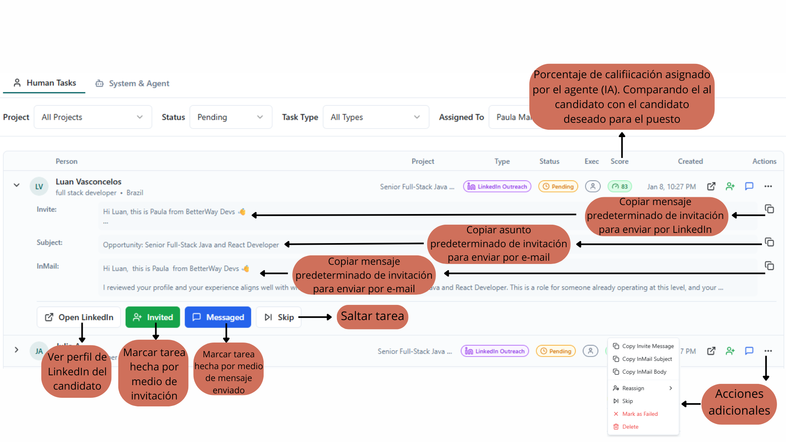
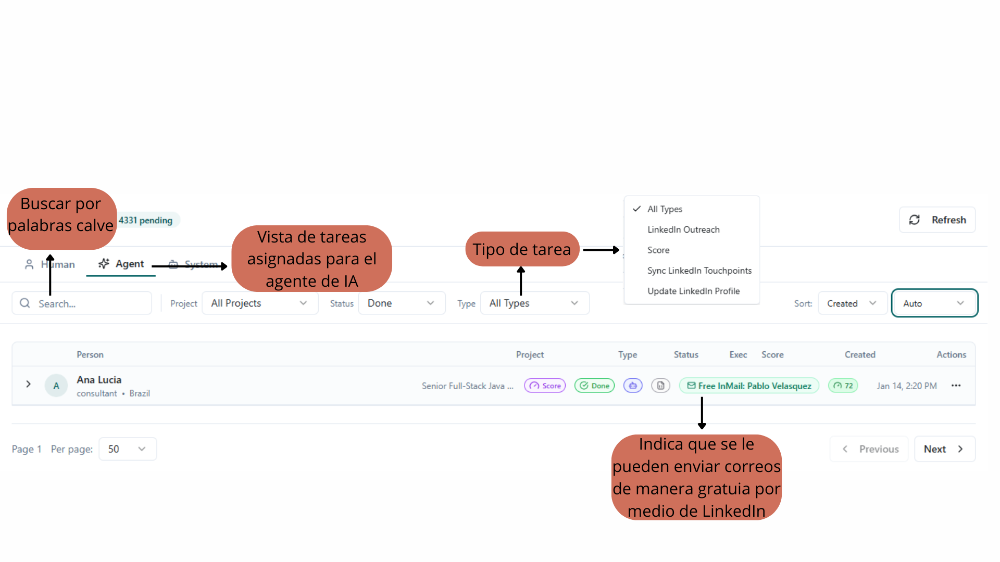
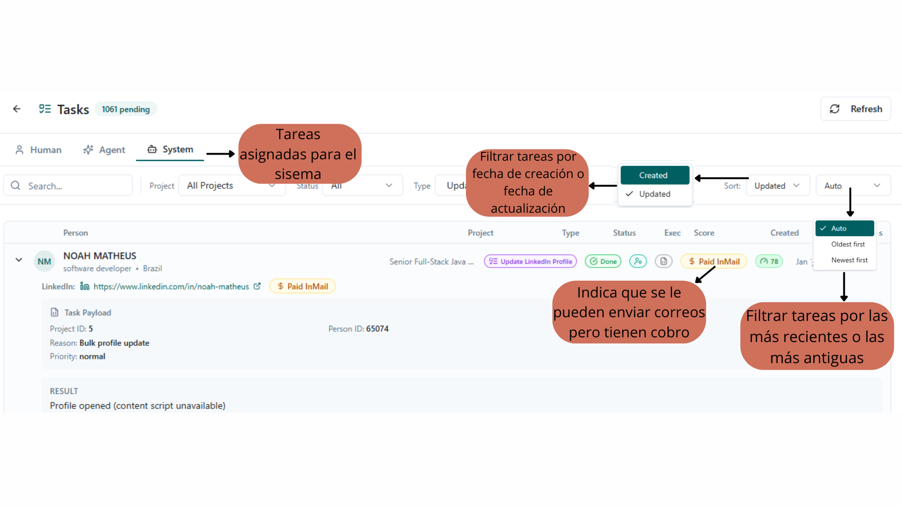

## Objective
Monitor all tasks. Pending, completed, in progress, postponed, failed tasks, or all together. In addition to user tasks, you can also see tasks assigned to the AI agent and the system. These tasks are performed automatically to speed up the work of team members.

## Task categories
- **User tasks:** Pending, completed, in progress, postponed, and failed tasks (see images 1 and 2).

image 1: user tasks

image 2: user tasks

- **Agent AI:** Tasks where AI makes assignment and execution decisions. The AI agent is capable of making decisions about the tasks assigned to it.
It has the ability to decide on its own where to assign a task when it can be performed or when it cannot (see image 3).

image 3: AI agent tasks

- **System:** Predefined automated processes without autonomous decision-making. The system itself is also designed to perform specific tasks, as long as it is within its capabilities to perform them. Unlike the AI agent, the system is not capable of deciding on its own (see image 4).

image 4: system tasks

## Daily use
Serves to verify that there are no blocks in automated flows and to ensure your manual responsibilities are covered.
